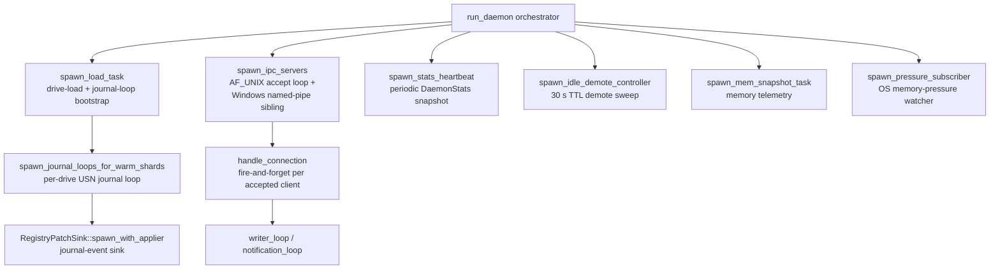

# ACMEX Concurrency Policy

ACMEX enforces a **strict task-ownership, lock-discipline, channel-backpressure, timeout-coverage, and blocking-IO posture in production async code** via a combination of:

  * workspace-wide Clippy lints (the `await_holding_lock`, `await_holding_refcell_ref` and `await_holding_invalid_type` families at `deny`), and
  * a per-site annotation contract that contributors quote inline at every spawn / lock / channel / timeout / blocking-IO call site.

This document is the project's **concurrency contract**: it codifies *what shape* a `tokio::spawn` / lock / channel / timeout / `std::fs::*`-in-async site must take, and *how* a contributor justifies one inline.

> **Provenance note.** This policy was extracted from a donor project
> (a Windows NTFS file-search tool whose daemon carried the async
> surface).  The rules, taxonomies, and annotation shapes apply to
> this workspace as-is - they bind the moment async code lands.  The
> runtime model (§0), per-crate posture (§5), spawn-site registry
> (§6), and audit trail (§9) are **illustrative donor examples**,
> kept to show what a mature project's version of this document looks
> like; the template skeleton itself is synchronous today.

The companion docs cover the broader posture:

  * [`lint-posture.md`](lint-posture.md) - workspace lint configuration.
  * [`panic_policy.md`](panic_policy.md) - when `unwrap` / `expect` / `panic!` is acceptable.
  * [`allocation_policy.md`](allocation_policy.md) - clone-and-allocation discipline in hot paths.
  * [`trait_policy.md`](trait_policy.md) - trait / generic / dispatch shapes.
  * [`dependency_policy.md`](dependency_policy.md) - feature additivity + dep duplication.
  * [`build_codegen_policy.md`](build_codegen_policy.md) - build.rs / macro / env-var justification.

---

## 0  The model at a glance (donor example)

This whole section describes the **donor project's** runtime model, kept as a worked example of the five-minute "model at a glance" write-up every async workspace should maintain.  The donor had one process where concurrency mattered in production - its daemon.  Three satellite binaries carried their own `#[tokio::main]` multi-threaded runtimes but were simpler one-shot CLIs or stateless protocol bridges; its CLI was sync end-to-end.  Everything in §1-§9 below follows from a model like this.

### 0.1  Daemon task graph

The donor daemon's startup graph spawned a fixed set of long-lived tasks named via dedicated `spawn_*` constructors in its daemon crate.  Eight tasks total (six top-level + two subsystem-internal):



Per-connection sub-tasks (`reader_loop`, `writer_loop`, `notification_loop`) are abort-on-EOF and not shown as top-level edges.  The full per-site rustdoc inventory lives in §6 ("Spawn-site registry") below.

### 0.2  Shard-state lifecycle

The donor daemon's index was a per-source collection of shards, each transitioning between six states (`ShardState`):

| State | Body | Bloom | Trie | Entered by |
|---|---|---|---|---|
| `Unknown` | – | – | – | initial discovery |
| `Cold` | – | – | – | parked-compactor demote (from `Parked`) |
| `Parked` | – | ✓ | ✓ | `spawn_idle_demote_controller` after TTL OR `spawn_pressure_subscriber` cascade |
| `Warm` | mmap | ✓ | ✓ | initial load OR promote from `Parked` |
| `Hot` | mmap + prefaulted | ✓ | ✓ | recent search activity |
| `Evicting` | (in transit) | – | – | transient - demote in progress |

Legal transitions are pinned in `ShardState::can_transition_to`.  The two demote drivers are:

  * **Idle TTL** - `spawn_idle_demote_controller` runs every 30 s and demotes `Warm`/`Hot` → `Parked` after a configurable idle-since-last-access window.
  * **Memory-pressure cascade** - `spawn_pressure_subscriber` listens to the OS memory-pressure watch and cascades `Warm` → `Cold` one step at a time on `Low` transitions, preempted by `High`/`Normal`.  No-op on Mac/Linux (the platform `PressureSignal` never fires by design).

### 0.3  IPC-request lifecycle

  1. **Accept** - `spawn_ipc_servers` runs the `AF_UNIX` accept loop on Unix and an `AF_UNIX` + Windows-named-pipe sibling pair on Windows.  Per-connection `MAX_CONNECTIONS = 1024` cap.
  2. **Per-connection task** - each accepted client spawns a fire-and-forget `handle_connection` task; ownership self-resets on socket EOF or `IDLE_CONNECTION_SECS = 60 s` idle timeout.
  3. **Reader / writer / notifier** - inside the connection task, `reader_loop` reads JSON-RPC frames and dispatches to `handler::handle_request`; `writer_loop` writes responses; `notification_loop` forwards broadcast events.  Sub-tasks are `.abort()`-ed when `reader_loop` returns.
  4. **Per-RPC timeout** - long-running methods carry their own deadline: search 30 s (`SEARCH_TIMEOUT`), drive-load `IndexManager::DRIVE_LOAD_TIMEOUT`, refresh fire-and-forget (immediate 202 ack; runs to completion or process exit).

### 0.4  Shutdown sequence

The terminal phase lived in the donor daemon's `await_shutdown_then_force_exit`:

  1. **Signal source** - idle timer expiry, `Ctrl-C`, or RPC `Shutdown` method.  Any one releases `lifecycle_mgr.run_idle_timer().await`.
  2. **IPC drain** - `ipc_task.abort()` cancels the accept loop; in-flight per-connection tasks finish their current request and exit on next read EOF.
  3. **Load drain** - `tokio::time::timeout(3 s, load_task)` waits briefly; abandons on the deadline because stuck kernel-mode I/O cannot be cancelled.
  4. **PID + socket cleanup** - `drop(lifecycle_mgr)` removes the PID file and the Unix-domain socket file.
  5. **Force exit** - `force_exit_with_watchdog` spawns a 5 s watchdog thread that calls `std::process::abort` if `process::exit` itself hangs (kernel I/O can wedge atexit handlers), then calls `process::exit(0)`.

---

## 1  The rule

Stated as a one-liner contributors can quote:

> **Every `tokio::spawn` declares its owner / shutdown / errors / cancellation.
> Every async lock guard is dropped before the next `.await`.
> Every channel is bounded with documented capacity OR unbounded with a documented producer-rate ceiling.
> Every cross-process / cross-thread / cross-network await has a timeout OR is justified as a cooperatively-cancelled forever-loop.
> Every `std::fs::*` / `std::thread::sleep` inside an `async fn` is either wrapped in `spawn_blocking` / `block_in_place` OR is a sync helper called only from sync contexts.**

The rule is enforced by **three layers**:

  1. **Clippy lints** at `deny` level in the workspace `Cargo.toml`:

     ```toml
     [workspace.lints.clippy]
     await_holding_lock           = "deny"  # No std::sync::Mutex held across .await
     await_holding_refcell_ref    = "deny"  # No RefCell::borrow() held across .await
     await_holding_invalid_type   = "deny"  # No Rc<T> / Cell<T> held across .await (Send violation)
     ```

     These three lints live in clippy's `suspicious` group (default `warn`) and are pinned at `deny` explicitly so the contract survives any future tightening of the workspace `-D warnings` shape - even if `--deny warnings` is removed from a CI gate, the named entries hold the line.

  2. **A workspace inventory sweep** - the donor project maintained a script (`concurrency_audit.sh`) emitting an 11-section Markdown report: per-crate async-surface table, `tokio::spawn` site list, async-lock site list, `.read/.write/.lock().await` candidate set, `Arc<Mutex<…>>` nesting, channel inventory, timeout coverage, blocking-IO-in-async candidate files, cancellation infrastructure, `#[tokio::test]` count.  This template does not ship the script; when async code lands, recreate the sweep (targeted `rg` passes over the same eleven patterns) and wire it into pre-push.

  3. **Per-site annotation contract** - every spawn / lock / channel / timeout / blocking-IO call site carries either a rustdoc `# Task ownership` / `# Concurrency` section OR an inline `// Concurrency:` comment explaining the invariant.  The policy categories below define the verdict vocabulary.

Test code is **exempt** from the spawn-ownership and timeout-coverage rules - `#[tokio::test]` harnesses spawn ephemeral tasks whose ownership is the test fixture itself, and timeouts in tests are replaced by `wait_for` polling primitives.  Test code is NOT exempt from the lock-discipline and blocking-IO rules (a lock held across `.await` in a test is the same bug it would be in prod).

---

## 2  The five dimensions

Every prod concurrency primitive in the workspace must fit exactly one of these five dimensions, each with a specific posture, taxonomy, and required treatment.

### 2.1  Task ownership

Every `tokio::spawn(` and every named `spawn_*` constructor function must answer four questions in rustdoc OR an inline `// Task ownership:` comment:

  * **Parent task** - which logical task owns this spawn?  Daemon main, IPC accept loop, per-shard journal loop, …
  * **Shutdown mechanism** - how does the spawned task receive a stop signal?  `watch::Sender<bool>`, drop-the-channel, parent-task cancellation, `CancellationToken`, `process::exit`, …
  * **Error observation policy** - what happens to the task's `Result` / panics?  Awaited and propagated, logged + dropped, `JoinSet`-collected, watchdog'd, …
  * **Cancellation behavior** - what state does cancellation leave behind?  Idempotent shutdown, partial-state OK, drains-on-cancel, fire-and-forget OK, …

Taxonomy:

| # | Category | Example | Required treatment |
|---|---|---|---|
| **T1** | Named constructor with explicit ownership | a `spawn_<subsystem>_loop` constructor | Rustdoc `# Task ownership` section answering all four questions |
| **T2** | Inline `tokio::spawn(` with documented inline shape | IPC connection-handler spawn | Inline `// Task ownership:` comment block above the spawn answering all four questions |
| **T3** | Fire-and-forget by design | a refresh handler (returns an immediate ack; task continues independently) | Inline `// Task ownership: fire-and-forget - <why this is correct>` comment |
| **T4** | Test-only spawn | `#[tokio::test] tokio::spawn(...)` | Exempt from the contract |

**Donor-project inventory (at audit close):** 18 prod sites + 9 test-only sites; all 18 prod sites carried T1/T2/T3 documentation.

### 2.2  Lock discipline

The workspace bans holding any lock across an `.await`.  Three lints at `deny` enforce the std::sync side mechanically; the async-lock side (`tokio::sync::{Mutex, RwLock}`) is enforced by hand-audit because Clippy cannot statically prove a `MutexGuard<…>` doesn't escape across an `.await` in tokio's `Mutex::lock().await` shape.

Taxonomy:

| # | Category | Example | Required treatment |
|---|---|---|---|
| **L1** | Extract-then-await | `let v = guard.field; drop(guard); other.await(v)` | Standard pattern; no annotation required |
| **L2** | Single-statement guard | `*self.counter.write() += 1` | Standard pattern; no annotation required |
| **L3** | Sync-only work inside guard | `let g = lock.read(); cpu_only(&g); /* no await */` | Standard pattern; no annotation required |
| **L4** | Explicit `drop(guard);` before await | `let g = lock.read(); let v = g.field; drop(g); v.await()` | Standard pattern; no annotation required |
| **L5** | Snapshot-then-await with rustdoc invariant | `status` RPC reading multiple fields under a single read guard | `# Concurrency` rustdoc on the enclosing fn naming the snapshot invariant |
| **L6** | **Lock held across `.await`** | **Forbidden** | **Refactor to L1/L4/L5; never suppress** |

**Donor-project inventory (at audit close):** 36 candidate sites; 34 textbook-clean (L1-L4), 2 augmented to L5 (a status RPC + an MCP dispatch).  0 L6 sites.

### 2.3  Channel discipline

Every channel construction must declare its bound or its "by-construction bounded" rationale.

Taxonomy:

| # | Category | Example | Required treatment |
|---|---|---|---|
| **C1** | Bounded `mpsc::channel(N)` with documented capacity | `event_channel(64)` | Rustdoc on the constructor naming N and why this capacity |
| **C2** | `broadcast::channel(N)` for fan-out | daemon notifications to multiple clients | Rustdoc naming N + the slow-consumer drop semantics |
| **C3** | `oneshot::channel()` for single-shot signal | shutdown notification | No annotation required (oneshot has no capacity question) |
| **C4** | `watch::channel(init)` for state-snapshot fan-out | per-shard cancel signal | No annotation required (watch keeps only latest) |
| **C5** | `mpsc::unbounded_channel()` with documented "by-construction bounded" rationale | donor example: a journal-event sink rate-bounded by its trigger; a notification forwarder rate-bounded by broadcast capacity | Inline `// Backpressure:` comment OR rustdoc on the field/constructor naming the upstream producer-rate ceiling + memory worst-case |
| **C6** | **Unbounded without rationale** | **Forbidden** | **Convert to C1 or document as C5; never leave undocumented** |

**Donor-project inventory (at audit close):** 2 prod unbounded channels, both C5 with documented ceilings.

### 2.4  Timeout policy

Every long-running cross-process / cross-thread / cross-network await must have a `tokio::time::timeout` OR a documented "deliberately blocking forever" rationale.

Taxonomy:

| # | Category | Example | Required treatment |
|---|---|---|---|
| **W1** | `tokio::time::timeout(const, fut).await` | an `IDLE_CONNECTION_SECS` constant on an IPC read loop | Named constant + inline `Action on expiry` comment |
| **W2** | Env-overridable deadline | an `ACMEX_*_TIMEOUT_SECS` knob on a client call | Const default + env-parse helper + `# Errors` rustdoc on the timeout error variant |
| **W3** | Cooperatively-cancelled forever-loop | a long-lived event loop (cancelled via `watch::Sender<bool>`) | Loop body documents the cancel-signal source in rustdoc |
| **W4** | Inline literal timeout (acceptable but a smell) | search dispatch 30 s | Inline `// <reason>` comment; flag for migration to W1 with a `DaemonConfig` knob in a future operator-config pass |
| **W5** | **Unbounded await on cross-process I/O** | **Forbidden** | **Wrap in `tokio::time::timeout` or convert to W3 with cancel-signal** |

**Donor-project inventory (at audit close):** 7 prod timeout sites across 4 crates.  No W5 sites.  One documented soft asymmetry: the async client used a hard-coded 300 s (W4) while the sync client used W2 with an env-overridable deadline.

### 2.5  Blocking-IO rule

Every `std::fs::*` / `std::thread::sleep` inside an `async fn` must be either:

  * **(a)** wrapped in `tokio::task::spawn_blocking` (preferred when the call site can give up ownership of its inputs), OR
  * **(b)** wrapped in `tokio::task::block_in_place` (use when ownership can't be cheaply transferred; requires multi-threaded runtime), OR
  * **(c)** inside a sync helper called only from sync contexts (CLI subcommand top-level, `Drop`, startup-once init).

Taxonomy:

| # | Category | Example | Required treatment |
|---|---|---|---|
| **B1** | `spawn_blocking` with owned inputs | a rayon-driven CPU-bound query | Inline comment naming the work-amplification + cost class |
| **B2** | `block_in_place` with borrowed inputs | donor example: a sync result-file writer | Inline comment explaining why `spawn_blocking` is not used (ownership / clone-cost trade-off) + runtime-multi-threaded requirement |
| **B3** | Sync helper called from sync context | a listener-bind or PID-file helper | Function is `fn` (not `async fn`); no special annotation |
| **B4** | Sync I/O at startup / `Drop` / one-shot CLI | a tracing-init `create_dir_all`; a 120-byte PID-file read at shutdown | Inline comment naming the "bounded one-shot" rationale |
| **B5** | **Unbounded sync I/O on async runtime worker** | **Forbidden** | **Convert to B1 / B2; never leave on the runtime hot path** |

**Donor-project inventory (at audit close):** 14 candidate files; 13 sites B3/B4-justified; 1 prior B5 site (a sync result-file writer) fixed to B2.  0 remaining B5 sites.

---

## 3  Shutdown coordination

A separate concern from the five dimensions above - every long-lived async task must observe a shutdown signal AND every shutdown signal must reach every task that observes it.

Workspace contract:

  * **Single source of truth** - the daemon's top-level `LifecycleHandle` owns the canonical `watch::Sender<bool>` used to broadcast cooperative shutdown to every spawned task.
  * **Fan-out via `watch::Receiver<bool>`** - every long-lived task `select!`s on its work future + `cancel_rx.changed().await`.
  * **Force-exit watchdog** - the daemon's `force_exit_with_watchdog` spawns a 5-second `std::thread::sleep` then `process::exit`; this guarantees a stuck kernel-mode I/O thread cannot prevent process termination.
  * **Per-shard journal loops** - each per-drive journal loop has its own `JournalLoopHandle::cancel()` API that flips its dedicated `watch::Sender<bool>` and joins the task.

Per-task shutdown semantics live at the spawn site under § 2.1's `# Task ownership` rubric.

---

## 4  Required annotation shapes

### 4.1  Per-spawn `# Task ownership` template

Every T1 site (named constructor) carries a rustdoc section like:

```rust
/// Spawn the per-shard USN journal loop for `drive`.
///
/// # Task ownership
///
/// * **Parent task** - daemon main runtime.
/// * **Shutdown mechanism** - `JournalLoopHandle::cancel()` flips the
///   per-loop `watch::Sender<bool>`; the loop's `select!` arm sees the
///   change and returns from the `loop`.
/// * **Error observation policy** - the `JoinHandle` is held by
///   `JournalLoopHandle`; `cancel()` returns the join future so the
///   caller can `.await` it to surface panics during shutdown.
/// * **Cancellation behavior** - the loop drains any pending
///   `SaveTrigger` before exiting; partial-state OK because the
///   applier task on the other side of `apply_tx` is idempotent on
///   `ApplyMsg::Save` (next batch will re-emit any missed events).
pub(crate) fn spawn_per_shard_journal_loop(/* … */) -> JournalLoopHandle { … }
```

T2 sites use the same four bullets as a `// Task ownership:` comment block.  T3 sites use a single-line `// Task ownership: fire-and-forget - <why this is correct>` comment.

### 4.2  Per-lock `# Concurrency` invariant template

L5 sites carry a rustdoc section like:

```rust
/// # Concurrency
///
/// Holds an `IndexManager` read guard while building the `StatusResponse`
/// payload (multiple field reads under a single guard for snapshot
/// consistency).  The `.await` on `build_search_profile` runs AFTER the
/// guard is dropped at the `;` on line N; the borrow checker enforces
/// this because `payload` does not outlive the guard.
async fn status(&self) -> StatusResponse { … }
```

### 4.3  Per-channel `// Backpressure:` rationale template

C5 sites carry an inline comment:

```rust
// Backpressure: unbounded by-design - producer rate is bounded upstream (see §2.3 C5).
let (notification_tx, notification_rx) = tokio::sync::mpsc::unbounded_channel();
```

OR a rustdoc block on the field:

```rust
/// Notification sender - incoming daemon notifications are forwarded here.
notification_tx: tokio::sync::mpsc::UnboundedSender<RpcNotification>,
```

with the upstream ceiling captured in a `# Backpressure` section on the wrapping struct OR a comment at the construction site.

### 4.4  Per-timeout `// <reason>` template

W4 sites (inline literal) carry a brief comment naming the reason:

```rust
// 30 s - interactive RPCs require sub-minute response; deliberately
// hard-coded for now, migrate to DaemonConfig in a future pass.
let search_outcome = tokio::time::timeout(
    core::time::Duration::from_secs(30),
    search_handle,
).await;
```

### 4.5  Per-blocking-IO `// Blocking-IO:` template

B2 sites carry a multi-line comment naming:

  * the work being blocked,
  * the worst-case cost class,
  * why `block_in_place` is chosen over `spawn_blocking`,
  * the runtime-multi-threaded requirement.

```rust
// Blocking-IO: `write_rows_to_file` does sync `File::create` +
// buffered `write_all` + `rename` on the tokio runtime thread.
// For large result sets (10⁵+ rows × ~200 bytes ≈ tens of MB),
// the write blocks for tens-to-hundreds of ms; `block_in_place`
// tells the multi-threaded runtime to move other tasks off this
// worker.  Cheaper than `spawn_blocking` here because the `Err`
// arm falls through to the IPC path and reuses `filtered_rows`.
let write_result = tokio::task::block_in_place(|| {
    Self::write_rows_to_file(&filtered_rows, output_path, &output_config)
});
```

---

## 5  Per-crate posture (donor example)

The five dimensions apply differently to each crate depending on its runtime model.  The template skeleton has no async crates yet - start this table when the first one lands.  The donor project's posture table is kept as a worked example:

| Crate | Runtime model | Primary dimensions | Notes |
|---|---|---|---|
| `acmex-daemon` | `#[tokio::main]` multi-threaded | All 5 + shutdown coordination | The most concurrency-sensitive crate; per-shard journal loops, IPC accept loop, search dispatch, idle-demote controller all live here |
| `acmex-mcp` | `#[tokio::main]` multi-threaded | T1/T2 spawn + W1/W2 timeouts | HTTP gateway + reload pipeline; CLI subcommands have B4 blocking-IO exemptions |
| `acmex-client` | both - an async client + a sync watchdog client | C5 backpressure + W2 timeouts | Async vs sync timeout asymmetry documented in the timeout audit |
| `acmex-mft` | CLI binary, mostly sync | B4 blocking-IO exemptions | CLI command handlers are inherently sequential |
| `acmex-core` | library, no runtime | None | Algorithmic core; no spawn / lock / channel / timeout sites |
| `acmex-security` | library, no runtime | None | Same |
| `acmex-broker` | Windows-only sync service | None | Synchronous named-pipe service; not in async runtime |

Per-crate rustdoc `# Concurrency` sections at each crate root summarize the runtime model + cross-link this policy.

---

## 6  Spawn-site registry (donor example)

Every async workspace maintains a complete enumeration of every prod `tokio::spawn(` call site, with the four facets the rule mandates (owner / shutdown / errors / cancellation).  The template skeleton has no spawn sites yet - this registry starts empty.  The donor project's registry (18 prod sites; its 9 `#[cfg(test)]` sites were exempt per §1) is kept as a worked example of the format:

| # | Group | Site | Constructor | Owner | Shutdown | Errors | Cancel |
|---|---|---|---|---|---|---|---|
| A1 | top-level | `daemon/src/lib.rs` | `spawn_load_task` | `run_daemon` (held) | `.abort()` in `await_shutdown_then_force_exit` | `tracing` inside | cooperative + abort fallback |
| A2 | top-level | `daemon/src/lib.rs` (`AF_UNIX`) | `spawn_ipc_servers` | `run_daemon` (held) | `.abort()` in shutdown | `tracing` | abort (accept loop is cancellation-safe) |
| A3 | top-level | `daemon/src/lib.rs` (named-pipe, win) | inline | dropped | process exit | `tracing` | none - watchdog reaps |
| A4 | top-level | `daemon/src/lib.rs` | `spawn_stats_heartbeat` | dropped (`_stats_task`) | process exit | broadcast (infallible) | runs to exit |
| A5 | top-level | `daemon/src/lib.rs` | `spawn_idle_demote_controller` | dropped | process exit | `tracing` | runs to exit |
| A6 | top-level | `daemon/src/lib.rs` | `spawn_pressure_subscriber` | dropped | watch-sender drop on `IndexManager` drop | `tracing` | **cooperative** |
| B1 | subsystem | `daemon/src/telemetry.rs` | `spawn_mem_snapshot_task` | dropped | process exit | `tracing` | runs to exit |
| B2 | subsystem | `daemon/src/cache/journal_sink.rs` | `RegistryPatchSink::spawn_with_applier` | held by sink | `Weak<IndexManager>` upgrade `None` | `tracing` | **cooperative** |
| B3 | subsystem | `daemon/src/cache/journal_loop.rs` | `spawn_journal_loop` | `JournalLoopHandle` | `cancel_tx.send(true)` (per-shard `watch`) | `JournalLoopHandle::wait_done()` for tests | **cooperative via `select!`** |
| C1 | per-conn | `daemon/src/ipc.rs` | `spawn_unix_connection` | dropped (per-conn) | socket EOF | `tracing::debug!` | none - bounded by `MAX_CONNECTIONS` + idle timeout |
| C2 | per-conn | `daemon/src/ipc.rs` (named-pipe, win) | inline | dropped | pipe EOF | `tracing::debug!` | none |
| C3 | per-conn | `daemon/src/ipc/windows_unix_bridge.rs` | inline (bridge) | dropped | duplex EOF | `tracing::debug!` | none |
| D1 | sub-task | `daemon/src/ipc.rs::handle_connection` | `Self::writer_loop` (inline) | parent connection | `.abort()` when `reader_loop` returns | indirect (via reader write fail) | abort |
| D2 | sub-task | `daemon/src/ipc.rs::handle_connection` | `Self::notification_loop` (inline) | parent connection | `.abort()` when `reader_loop` returns | indirect (broadcast `Closed`/`Lagged`) | abort |
| E1 | one-shot | `daemon/src/handler.rs` | inline (`handle_refresh`) | dropped | runs to completion **or** process exit | `tracing` inside `IndexManager::refresh` | none - short-lived |
| F1 | runtime | `daemon/src/index/dispatch.rs` | inline (single-flight cleanup) | dropped | cooperative via `Shared` future | discarded (every awaiter has own clone) | none - cleanup IS the cancel-safety mechanism |
| F2 | client | `client/src/connect_keepalive.rs` | `start_keepalive` | `KeepaliveGuard` | `oneshot::Sender` drop on guard drop | `tracing::debug!` | **cooperative via oneshot drop (RAII)** |
| F3 | binary | `mft/src/main.rs` | inline (`run_until_shutdown`) | local `run_task` | `Ctrl-C` via `tokio::select!` arm | `JoinError` classified by `classify_binary_task_error` | abort on signal; cooperative on natural completion |

**Group legend:** A = daemon top-level orchestration (`run_daemon`-spawned).  B = subsystem long-lived constructors.  C = per-connection IPC.  D = IPC connection-internal sub-tasks.  E = application one-shots.  F = runtime cleanup / external-crate spawns.

Adding a new prod `tokio::spawn(` site requires a corresponding row here in the same PR - a spawn site with no matching registry row fails review.

---

## 7  Verification

Every PR that touches async code must surface a clean run of:

```sh
just lint-prod                 # Clippy with await-holding lints at deny
```

plus a manual sweep whose per-dimension counts are the contract:

  * **spawn sites** (`rg 'tokio::spawn'`) - every new prod site needs T1/T2/T3 documentation and a §6 registry row.
  * **lock-across-await candidates** - every new entry needs an L1-L5 verdict in the PR description.
  * **missing-timeout candidates** - every new entry needs a W1-W4 verdict.
  * **blocking-IO-in-async candidates** (`rg 'std::fs::|thread::sleep'` over async fns) - every new file needs a B1-B4 verdict.

Test code is exempt from the spawn-ownership and timeout-coverage rules; lock-discipline and blocking-IO rules apply equally to tests.

---

## 8  Anti-patterns

These shapes are **always wrong** in production code; submit a PR converting them, not suppressing them:

  * **Holding a lock across `.await`** - refactor to L1/L4 extract-then-await OR L5 snapshot-then-await.
  * **`mpsc::unbounded_channel()` without a documented producer-rate ceiling** - convert to bounded OR document the ceiling as C5.
  * **Cross-process `.await` without a timeout** - wrap in `tokio::time::timeout` OR add a `select!` cancel arm.
  * **`std::fs::*` / `std::thread::sleep` directly inside an `async fn`** - wrap in `block_in_place` (B2) or `spawn_blocking` (B1), OR move to a sync helper (B3).
  * **`tokio::spawn(...)` whose `JoinHandle` is dropped without a documented "fire-and-forget OK" reason** - convert to T3 with an inline `// Task ownership: fire-and-forget - …` comment.
  * **`Arc<Mutex<Arc<Mutex<…>>>>` nesting** - flatten to a single lock OR refactor to actor-style channel ownership.
  * **`std::sync::Mutex` in an async context** - convert to `tokio::sync::Mutex` OR move the locked work into a `spawn_blocking` so it's clearly sync.

---

## 9  Audit trail (donor example)

In the donor project, the five dimensions above were each closed in a separate PR over one audit phase:

  * **10a** - the concurrency-audit baseline tool (#303).
  * **10b** - Lock-across-await audit; 2 of 36 sites refactored to L5 (#304).
  * **10c** - Task ownership inventory; 18 prod sites documented (#305).
  * **10d** - Backpressure audit; 2 prod unbounded channels documented as C5 (#306).
  * **10e** - Timeout coverage audit; 7 prod sites inventoried (findings-only, folded here).
  * **10f** - Blocking-IO-in-async audit; 1 real prod hazard fixed via B2 `block_in_place` (#307).
  * **10g** - this policy doc + per-crate `# Concurrency` rustdoc + daemon `lib.rs` decomposition + §0 model + §6 spawn-site registry + named `await_holding_*` clippy entries (#308).
  * **10h** - `phase_10_final_report.md` (local-only) + tracking-issue closeout (#308).

The donor's per-site verdict tables were local working documents; the sweep can be re-run at any time to regenerate the inventory.
